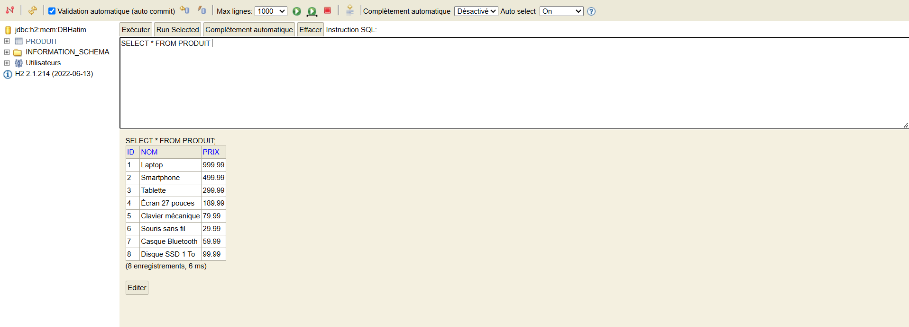
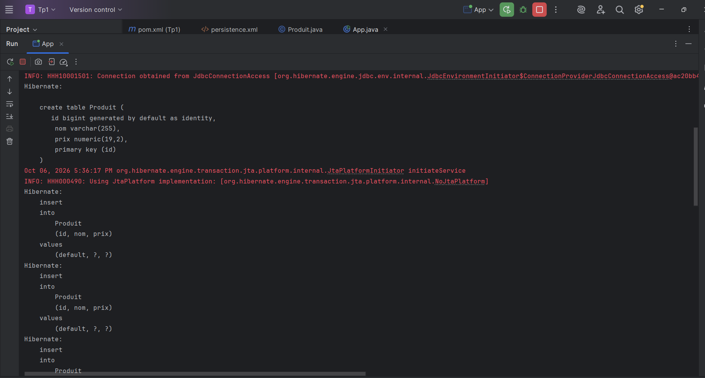
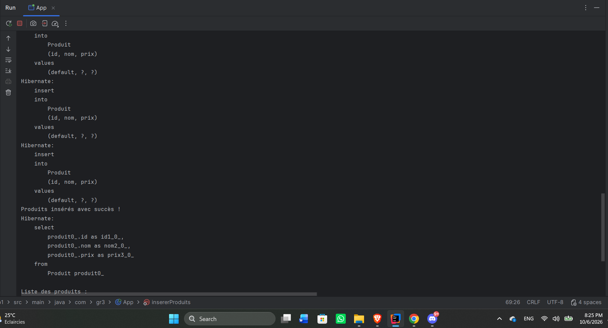
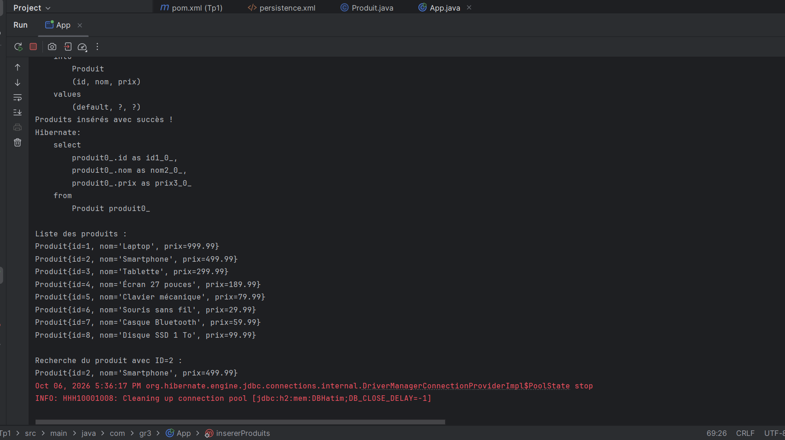

## Captures des résultats

### 1. Affichage des produits dans la console H2
La requête `SELECT * FROM PRODUIT` affiche les produits enregistrés.

### 2. Création de la table et insertion des produits
Hibernate crée la table `Produit` et exécute les requêtes d’insertion.

### 3. Confirmation de l’insertion
Le programme confirme l’insertion des produits et lance leur lecture.

### 4. Liste des produits et recherche par ID
La liste contient huit produits. La recherche de l’ID `2` retourne le Smartphone.

